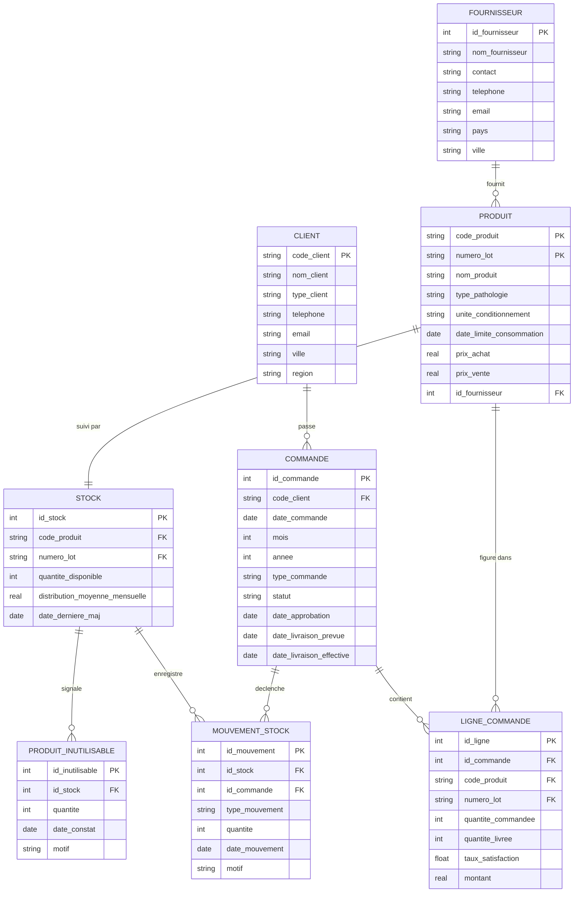

```mermaid
```mermaid
erDiagram
    FOURNISSEUR {
        int id_fournisseur PK
        string nom_fournisseur
        string contact
        string telephone
        string email
        string pays
        string ville
    }

    PRODUIT {
        string code_produit PK
        string numero_lot PK
        string nom_produit
        string type_pathologie
        string unite_conditionnement
        date date_limite_consommation
        real prix_achat
        real prix_vente
        int id_fournisseur FK
    }

    CLIENT {
        string code_client PK
        string nom_client
        string type_client
        string telephone
        string email
        string ville
        string region
    }

    COMMANDE {
        int id_commande PK
        string code_client FK
        date date_commande
        int mois
        int annee
        string type_commande
        string statut
        date date_approbation
        date date_livraison_prevue
        date date_livraison_effective
    }

    LIGNE_COMMANDE {
        int id_ligne PK
        int id_commande FK
        string code_produit FK
        string numero_lot FK
        int quantite_commandee
        int quantite_livree
        float taux_satisfaction
        real montant
    }

    STOCK {
        int id_stock PK
        string code_produit FK
        string numero_lot FK
        int quantite_disponible
        real distribution_moyenne_mensuelle
        date date_derniere_maj
    }

    MOUVEMENT_STOCK {
        int id_mouvement PK
        int id_stock FK
        int id_commande FK
        string type_mouvement
        int quantite
        date date_mouvement
        string motif
    }

    PRODUIT_INUTILISABLE {
        int id_inutilisable PK
        int id_stock FK
        int quantite
        date date_constat
        string motif
    }

    FOURNISSEUR ||--o{ PRODUIT : "fournit"
    PRODUIT ||--|| STOCK : "suivi par"
    PRODUIT ||--o{ LIGNE_COMMANDE : "figure dans"
    CLIENT ||--o{ COMMANDE : "passe"
    COMMANDE ||--o{ LIGNE_COMMANDE : "contient"
    COMMANDE ||--o{ MOUVEMENT_STOCK : "declenche"
    STOCK ||--o{ MOUVEMENT_STOCK : "enregistre"
    STOCK ||--o{ PRODUIT_INUTILISABLE : "signale"
```
  ```